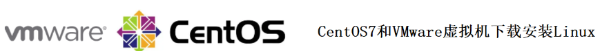
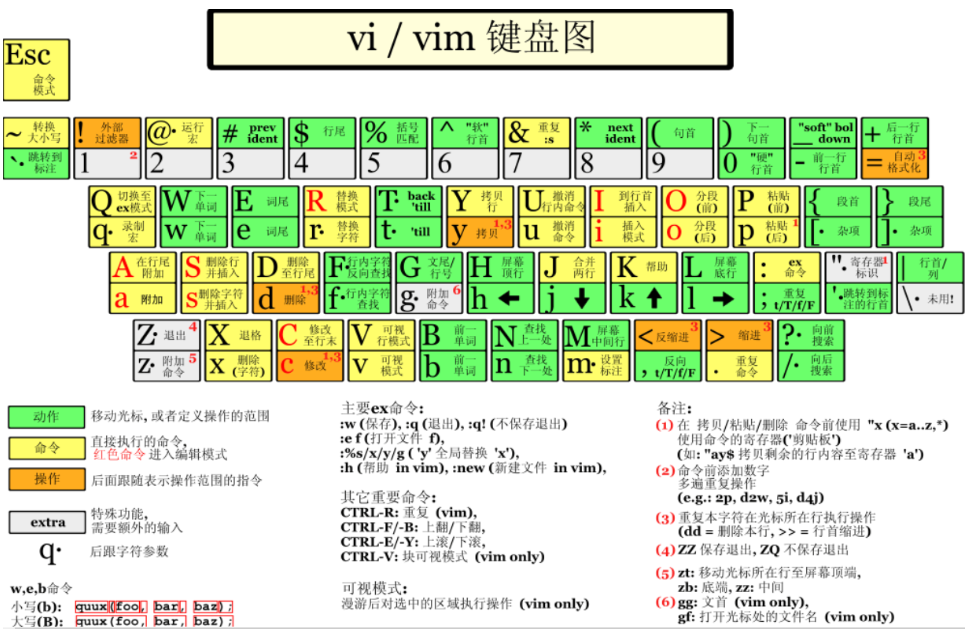
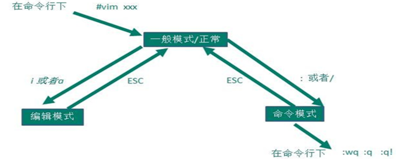
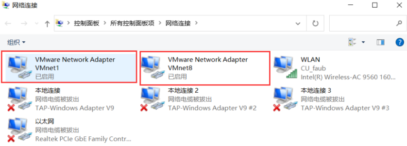
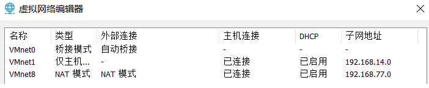
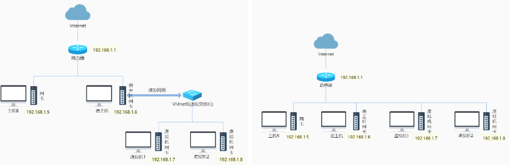

#Linux概述
Linux是一个操作系统(OS)

20世纪80年代，由于Unix 版权的限制，荷兰阿姆斯特丹Vrije大学的Andrew S. Tanenbaum教授决定写一个系统，名为MINIX(即小型的UNIX)，并开放全部源代码给大学教学和研究工作。李纳斯·托瓦兹在赫尔辛基大学读书时也使用了Andrew教授的Minix系统，但他觉得实在太难用，于是也决定自己开发一个操作系统。

李纳斯·托瓦兹(Linus Torvalds)在1991年初，开始基于Minix(Unix变种)进行开发，同年九月，开发完成内核的0.01版本，命名为Linux。

1960年代末，肯·汤普逊和丹尼斯·里奇一起参与了一个项目，由贝尔实验室、麻省理工学院、以及通用电气公司联合开发了一套多使用者分时作业系统，名叫Multics(MULTiplexed Information and Computing System)，后来由于种种原因Multics计划失败。之后，他和丹尼斯·里奇花了一个月的时间用之前他们设计的B语言开发了一套全新的操作系统，并起名叫做 Unics(UNiplexed Information and Computing System)，后来，Unics慢慢就变成了Unix。

第一版的Unix是基于B语言来开发的。B语言在进行系统编程时不够强大。汤普逊和丹尼斯·里奇对其进行了改造，并于1971年发明了C语言。1973年他们用C语言对 Unix系统进行了重新编写。

#Linux安装与下载
CentOS 7是一个企业级的Linux发行版本，它源于RedHat：Red Hat（红帽）是一家开源解决方案供应商)免费公开的源代码进行再发行

下载教程网站：https://blog.csdn.net/da_ge_de_nv_ren/article/details/128408962

#/目录
Linux 的一切资源都挂载在 / 节点下。
👉/bin： Binary的缩写。存放系统命令，普通用户和 root 都可以执行。放在 /bin 下的命令在单用户模式下也可以执行。
👉/boot： 这里存放的是启动 Linux 时使用的一些核心文件，包括一些连接文件以及镜像文件。
👉/dev： Device的缩写。该目录下存放的是 Linux 的外部硬件设备，在 Linux 中访问设备的方式和访问文件的方式是相同的。
👉/etc： Etcetera的缩写。这个目录用来存放所有的系统管理所需要的配置文件和子目录。
👉/home： 用户的主目录，在 Linux 中，每个用户都有一个自己的目录，一般该目录名是以用户的账号命名的。
👉/lib： Library的缩写。这个目录里存放着系统最基本的动态连接共享库，其作用类似于 Windows 里的 DLL 文件。几乎所有的应用程序都需要用到这些共享库。
👉/lib64： 64位相关的库会放在这。
👉/media： linux 系统会自动识别一些设备，例如U盘、光驱等等，当识别后，Linux 会把识别的设备挂载到这个目录下。
👉/mnt： 系统提供该目录是为了让用户临时挂载别的文件系统的，我们可以将光驱挂载在 /mnt/ 上，然后进入该目录就可以查看光驱里的内容了。
👉/opt： optional的缩写。这是给主机额外安装软件所摆放的目录。
👉/proc： Processes的缩写。/proc 是一种伪文件系统（也即虚拟文件系统），存储的是当前内核运行状态的一系列特殊文件，这个目录是一个虚拟的目录，它是系统内存的映射，我们可以通过直接访问这个目录来获取系统信息。这个目录的内容不在硬盘上而是在内存里
👉/root： 该目录为系统管理员，也称作超级权限者的用户主目录。
👉/run： 运行目录
👉/sbin： s 就是 Super User 的意思，是 Superuser Binaries (超级用户的二进制文件) 的缩写，这里存放的是系统管理员使用的系统管理程序。
👉/srv： 该目录存放一些服务启动之后需要提取的数据。
👉/sys： 虚拟文件系统。和 /proc/ 目录相似，该目录中的数据都保存在内存中，主要保存与内核相关的信息
👉/tmp： temporary的缩写这个目录是用来存放一些临时文件的。
👉/usr： unix system resources缩写。用于存储系统软件资源。
👉/var： 用于存储动态数据，例如缓存、日志文件、软件运行过程中产生的文件等

#VI/VIM
VI是Unix操作系统和类Unix操作系统中最通用的文本编辑器。
VIM编辑器是从VI发展出来的一个性能更强大的文本编辑器。可以主动的以字体颜色辨别语法的正确性，方便程序设计。VIM 与VI编辑器完全兼容。

基本上 vi/vim 共分为三种模式，分别是一般模式，编辑模式和命令模式。

###一般模式
刚刚启动 vi/vim，便进入了一般模式(默认模式)。此状态下敲击键盘动作会被Vim识别为命令，而非输入字符。在此模式可以复制黏贴，删除等操作。若想要编辑文本，进入一般模式，按下i，切换到编辑模式。

| 按键|说明 |
| - | - |
| x | 向后删除一个字符，相当于 del |
| X  | shift + x，向前删除一个字符，相当于backspace |
| nx | n按完后再按x，n 为数字，连续向后删除 n 个字符 |
| dd | 向前删除一个字符，相当于backspace |
| ndd | n 为数字。删除光标所在的向下 n 行 |
| d1G | 删除光标所在到第一行的所有数据 |
| dG | 删除光标所在到最后一行的所有数据 |
| d$ | 删除游标所在处，到该行的最后一个字符 |
| d0 | 删除游标所在处，到该行的最前面一个字符 |
| yy | 复制，复制游标所在的那一行(常用) |
| nyy | n 为数字。复制光标所在的向下 n 行 |
| y1G	 |复制游标所在行到第一行的所有数据 |
| yG | 复制游标所在行到最后一行的所有数据 |
| y0 | 复制光标所在的那个字符到该行行首的所有数据 |
| y$ | 复制光标所在的那个字符到该行行尾的所有数据 |
| p | 粘贴，将已复制的数据在光标下一行贴上 |
| P | 将已复制的数据在光标上一行贴上 |
| J | 大写，将光标所在行与下一行的数据结合成同一行 |
| c | 重复删除多个数据，例：向下删除 10 行：10cj，cj小写 |
| u | 复原前一个动作 |
| Ctrl+r | 重做上一个动作 |
| + | 光标移动到非空格符(注意：是空格符，不是空行)的下一行 |
| - | 光标移动到非空格符的上一行 |
| n + space | space空格键，n 表示数字，光标会向右移动这一行的 n 个字符 |
| 0 或Home键 | 移动到这一行的最前面字符处 |
| $ 或End | 移动到这一行的最后面字符处 |
| H | 光标移动到这个屏幕的最上方那一行的第一个字符 |
| M | 光标移动到这个屏幕的中央那一行的第一个字符 |
| L | 光标移动到这个屏幕的最下方那一行的第一个字符 |
| G | 移动到这个档案的最后一行 |
| nG | n 为数字。移动到这个档案的第 n 行 |
| gg | 移动到这个档案的第一行 |
| n + Enter | Enter回车键，n 为数字。光标向下移动 n 行 |
| /n | n为要搜索的内容。向光标之下寻找一个名称为n的字符串 |
| ?n | 向光标之上寻找一个字符串名称为n的字符串 |
| n | 重复前一个搜寻的动作 |
| N | 与 n 相反，反向进行前一个搜寻动作 |
| h 或 ← | 光标向左移动一个字符 |
| j 或 ↓ | 光标向下移动一个字符 |
| k 或 ↑ | 光标向上移动一个字符 |
| l 或 → | 光标向右移动一个字符 |
| Ctrl+ f | 屏幕向下移动一页，相当于Page Down按键 |
| Ctrl + b] | 屏幕向上移动一页，相当于Page Up按键 |
| Ctrl+ d | 屏幕向下移动半页 |
| Ctrl + u | 屏幕向上移动半页 |

###编辑模式
在一般模式之中，只要按下 i, o, a 等字符就可以进入输入模式。在编辑模式当中，左下角状态栏中会出现 –INSERT- 的字样，那就是可以输入任意字符的提示。这个时候，键盘上除了 Esc 这个按键之外，其他的按键都可以视作为一般的输入按钮。
| 按键|说明 |
| - | - |
| i, I | 向后删除一个字符，相当于 del |
| a, A | a 为从目前光标所在的下一个字符处开始输入， A 为从光标所在行的最后一个字符处开始输入 |
| o, O | o 为在目前光标所在的下一行处输入新的一行； O 为在目前光标所在的上一行处输入新的一行 |
| r, R | r 只会取代光标所在的那一个字符一次；R会一直取代光标所在的文字，直到按下 ESC 为止 |

###命令模式
在一般模式之中，只要按下 ：或 / 就可以进入命令模式。
| 按键|说明 |
| - | - |
| :w | 保存 |
| :w! | 若文件属性为只读时，强制写入该档案。不过，能不能写入， 还跟你对该档案的档案权限有关 |
| :q | 退出 |
| :q! | 强制退出 |
| :wq | 保存并退出 |
| ZZ | 效果等同于保存并退出 |
| ZQ | 效果等同于 :q! |
| :w filename | filename表示文件名，注意不是相对路径是文件名，将编辑的数据储存成另一个文件 |
| :r filename | 在编辑的数据中，读入另一个文件的数据。将filename这个档案内容加到游标所在行后面 |
| :n1,n2 w filename | 将 n1 到 n2 的内容储存成 filename 这个档案 |
| :! command | 暂时离开 vi 到指令行模式下执行 command 的显示结果！例：:! ls /home 即可在 vi 当中察看 /home 底下以 ls 输出的档案信息 |
| :set nu | 显示行号 |
| :set nonu | 取消行号 |
| :noh | 取消高亮显示 |
| : s/old/new | 替换当前匹配到的第一个 old 为 new |
| :%s/old/new | 替换文档中每一行匹配到的第一个 old 为 new |
| :%s/old/new/g | 替换文档中匹配到所有的 old 为 new |

#网络配置
VMware安装完成后会在宿主机上生成两块虚拟网卡，这两块网卡与虚拟机管理的两个虚拟交换机相连。
 
VMware管理了3个特殊的虚拟交换机：VMnet0（用于桥接模式），VMnet8（用于NAT模式），VMnet1（用于仅主机模式）。

VMware提供了3种网络工作模式：Bridged(桥接模式)，NAT（网络地址转换模式），Host-Only（仅主机模式）。

###桥接模式
📎 虚拟机直接连接外部物理网络的模式，主机起到了网桥的作用。这种模式下，虚拟机可以直接访问外部网络，并且对外部网络是可见的。

👉将宿主机的网卡通过虚拟网桥与VMware管理的虚拟交换机VMnet0相连，所有网络连接设置为桥接模式的虚拟机都会连接到虚拟交换机VMnet0上。

👉这样所有的虚拟机与宿主机以及与宿主机在同一个局域网下的主机之间都是可以相互访问的。

👉在桥接模式下，虚拟机IP地址需要与宿主机在同一个网段，如果需要联网，则虚拟机的网关和DNS也需要与宿主机被桥接的网卡一致。

